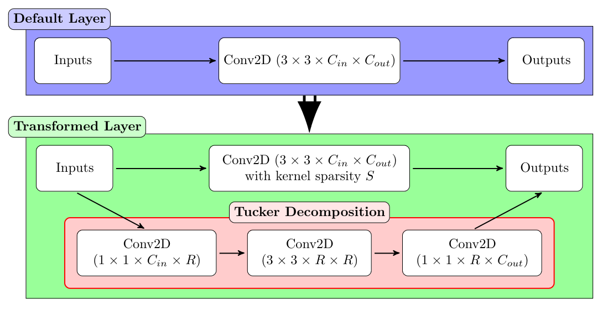

# tf-hybrid-pruning

TB2 individual project - exploring hybrid optimisation methods for data-free inference optimisations on mobile devices.

### Acknoledgements

I would like to thank XMOS for generously sponsoring this project and express my gratitude to Andrew Stanford-Jason for providing valuable insight.

## Motivation

The goal of this project is to create a data-free technique to compress Convolutional Neural Networks (CNN) for inference on mobile hardware. The intended use case is to support optimisations for a wide variety of hardware architectures and resource constraints. This project would enable developers to train a single network then optimise it for deployment for arbitrary devices such as embedded systems, mobile phones or web applications.

## Approach

As of now the project only supports TensorFlow and ResNet50. Finding compression factors for other network architectures should be straightforward, but the user will need to define the decomposition block in the script that generates the model. This limitation will be rectified as soon as TensorFlow adds support for "model surgery", which is currently being worked according to comment on a [recent issue](https://github.com/keras-team/keras/issues/17569) from a TensorFlow contributor:

> Frightera: Edit2 (05.04.23): I'll be working on this actively, this is half complete now.

This project implements a hybrid compression technique based on tensor decompositions with added sparsity. The decomposition technique in use is a modified version of a Tucker decomposition, and the pruning structure can be arbitrarily adjusted to fit the requirements of the target hardware. Each `Conv2D` layer is split into four smaller `Conv2D` layers as represented by the diagram below:



This framework supports two compression approaches:

- An evaluation led approach, where we fix the maximum acceptable loss of accuracy and maximise the compression factor. This approach requires access to a minimal test dataset.
- A fixed compression approach, where the user defines a compression factor based on memory constraints or inference times, and the library aims to meet those constraints with minimal reconstruction loss. This approach does not require any data, but may lead to a severe degradation in accuracy if the hyper-parameters aren't chosen appropriately or the compression factor is too high.

## Setup

1. Clone this repository.
2. Create a Python virtual environment and install dependancies:

```
python -m venv env
source env/bin/activate
pip install -r requirements.txt
```

## Usage

To get started, you will need pre-trained ResNet50 weights of the same shape as the model defined in `src/model.py`. You may generate those weights using `scripts/train.py`, or load them from LFS. Model surgery for arbitrary model is planned but not supported yet.

To compress ResNet50 with an evaluation-led approach with a maximum of 2% accuracy loss and unstructured sparsity, run the following command:

```
python scripts/compress.py --input_path /path/to/input/model_weights --output_path /path/to/output/compressed_model.tflite --pruning_structure unstructured --method fixed_loss --max_acc_loss 0.02
```

The following pruning structures are implemented:

- `--pruning_structure=unstructured` for unstructured sparsity
- `--pruning_structure=filter` for filter sparsity (along the 4th axis)
- `--pruning_structure=channel` for channel sparsity (along the 3rd axis)
- `--pruning_structure=block` for block sparsity, in which case `--block_size` should be provided, determining the size of the block (e.g., `--block_size 2,2`)

To compress ResNet50 with a fixed compression factor of 0.5 and unstructured sparsity, run the following command:

```
python scripts/compress.py --input_path /path/to/input/model_weights --output_path /path/to/output/compressed_model.tflite --pruning_structure unstructured --method fixed_params --compression_factor 0.5
```

Run `python scripts/compress.py --help` for more arguments and usage information.

## File structure

>

    .
    ├── .gitignore                                # Git ignore file
    ├── models                                    # Model files
    |   ├── keras                                 # Keras SaveModel models
    │   └── lite                                  # TFLite models
    ├── notebooks                                 # Jupyter notebooks
    │   └── Test.ipynb                            # Testing and EDA
    ├── README.md                                 # This file
    ├── requirements.txt                          # Package dependencies
    ├── scripts                                   # Scripts for various tasks
    │   ├── benchmarks.sh                         # Benchmarking script (loop over compress.py)
    │   ├── compress.py                           # Main compression script
    │   ├── data.py                               # Data visualisation
    │   └── train.py                              # Training script, generate base model
    └── src                                       # Source code
        ├── custom_resnet.py                      # Code to generate custom ResNet50 model with decompositions
        ├── dataset.py                            # Custom Dataset object for CIFAR-100
        ├── model.py                              # Generate base model compatible with CIFAR-100
        ├── pruning.py                            # Pruning loop
        └── utils.py                              # Various utilities and datastructes

>

## TODO

### REPO

- Optimise `get\_whatif`
- Different size datasets first!
- Save factors separately
- Argparse for TFLite converter
- Convert repository to library
- Generate comparison plots
- Add support for memory-first optimisation
- Add 1x1 `Conv2D` support
- Benchmark quantisation methods
- Add unit tests
- Type checking
- Code for DeepDream

### REPORT

- Examples
- Change outdated naive results
- ReLU in DeepDream plots
